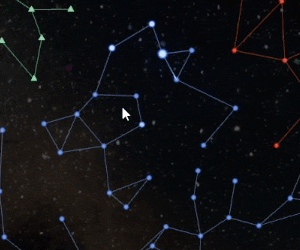

# Musical Constellations

[](https://ko-fi.com/W7W2X7WN)

This is a little experiment that answers the question: what happens if you turn the constellations in the sky into music?



You can click on the constellations to make them play little melodies. You can right click to make them stop.

[I made an in-depth video about all the mathematical details behind all this, including a demo at the end!](https://www.youtube.com/watch?v=hbHPq21pvbQ)

The program generates constellations based on a randomly generated seed. It appears in a textbox on the top-left of the screen. If you found a seed that sounds nice, be sure to share it with the rest of the world!

## Download

To try it out, [grab the executables here](https://github.com/Bauxitedev/musical_constellations/releases). Windows and Linux (x86_64) only for now!

Running at at least 1080p resolution is recommended to get the smoothest lines!

Your PC should be fairly decent, at least as fast as a Steam Deck, to get 60fps. (On a Steam Deck it runs perfectly by the way at 720p 60fps.)

## Compiling from scratch

1. Install [Rust](https://rustup.rs/) if you don't have it yet.
2. Go to the `rust` folder in this repo and run `cargo build --release`.
3. Get [Godot 4.4.1](https://godotengine.org/download/archive/4.4.1-stable/) if you don't have it yet.
4. Go to the `godot` folder and open `project.godot` with Godot.

## CLI arguments

You can pass CLI arguments to the program like this:

```pwsh
musical_constellations.exe -- --skip-intro --windowed --seed ABCDEF
```

To see all options, run `musical_constellations.exe -- --help`. (On Linux the game will be called `musical_constellations.x86_64`.)

Note: the `--` is needed to indicate the arguments are to be passed to the game itself, instead of the Godot engine.

## Debugging and profiling

See [DEBUGGING.md](DEBUGGING.md).

## Attribution

- Background HDRi file from ambientCG, licensed under the Creative Commons CC0 1.0 Universal License.
- Most other assets from Kenney Game Assets, licensed under the Creative Commons CC0 1.0 Universal License.
- Inter font from [rsms.me](https://rsms.me/inter/), licensed under the SIL Open Font License 1.1.
- Inconsolata font by Raph Levien, licensed under the SIL Open Font License 1.1.

## License

MIT for the code. Original licenses for the assets attributed above.
